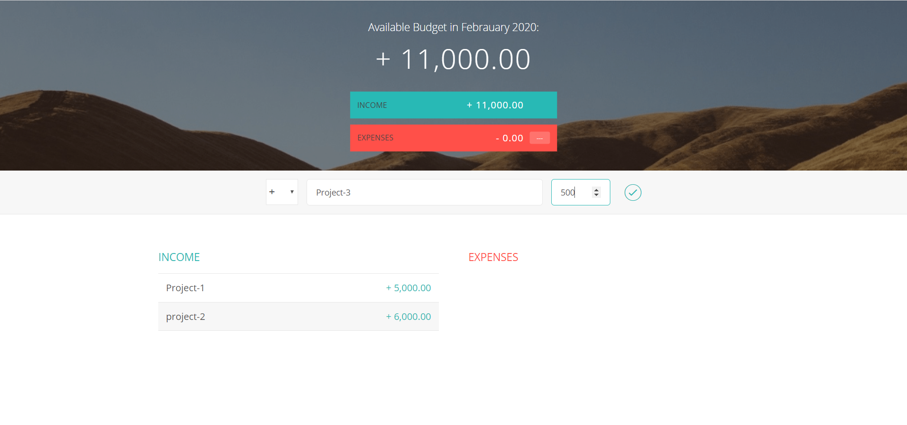
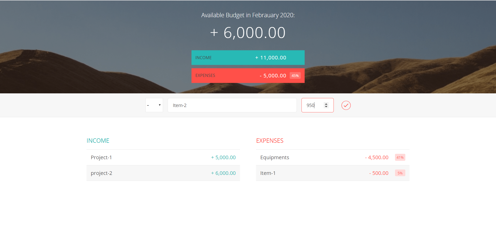

# Budget App

The following Screenshots are the output of the given options in the App.

### App View

### After Adding Income

### Expenses Added

### Delete Sign
The Delete Sign is use to delete the particular income & expenses from the app.

### Updated View

After Deleting Item-1 Expense from the App.

